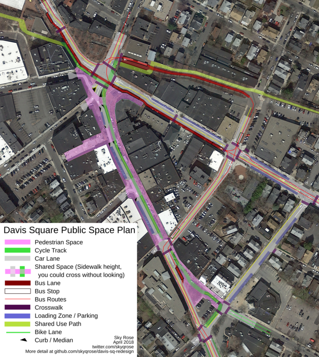

[(high resolution)](/davis.png)
[(svg)](/davis.svg)

This is a hypothetical map of Davis Square if space that's currently taken by cars was reallocated to walkers, bikers, and transit takers instead.

[The full description is on my blog.](http://www.skyqrose.com/2018/05/02/davis-sq-redesign.html)
