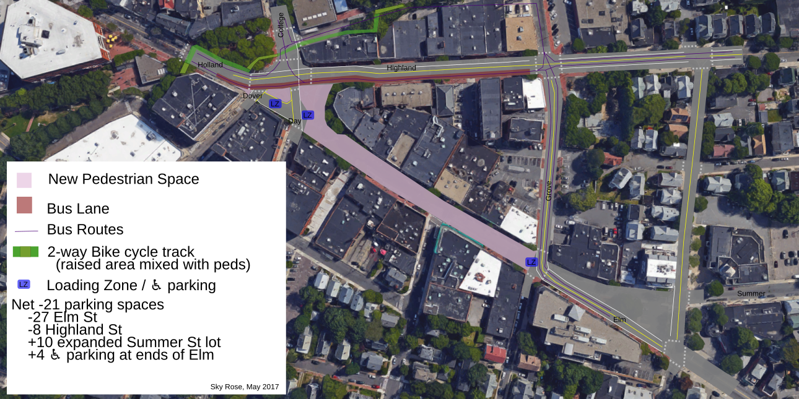

This is a hypothetical map of Davis Square if space that's currently taken by cars was reallocated to walkers, bikers, and transit takers instead.

It was inspired by [this Twitter post](https://twitter.com/BrendanJKearney/status/866028770649681925). Discussions about a [previous version](v1.png) are on [Twitter](https://twitter.com/skyqrose/status/867314846957801472) and [DreamWidth](http://davis-square.dreamwidth.org/3616076.html), but my most up-to-date plan will be here. The previous version removed all cars from Elm St, but received pushback, so this version imagines Elm St having local car access but through car access would be available via a two-way Highland Ave and Grove St.

If you have contacts within the Somerville planning board, I'd be interested in making this actually happen.

### Other relevant links:
* [Davis Square Neighborhood Plan Draft, April 2018](https://2xbcbm3dmbsg12akbzq9ef2k-wpengine.netdna-ssl.com/wp-content/uploads/2018/04/20180427-DSQ-Neighborhood-Plan_PublicReviewDraft_Reduced.pdf?mc_cid=1832f21f8d&mc_eid=20246d37e3), which includes some similar intersection changes.
* [Somerville By Design](https://www.somervillebydesign.com/neighborhood-planning/davis-square/)
  - [Goals and community input](https://2xbcbm3dmbsg12akbzq9ef2k-wpengine.netdna-ssl.com/wp-content/uploads/2014/05/Concerns-and-Improvements-Diagrams.pdf)
  - [April 2014 design](https://2xbcbm3dmbsg12akbzq9ef2k-wpengine.netdna-ssl.com/wp-content/uploads/2014/05/Design_Update_Apr14.pdf) (with great community path ideas)
* [Proposed improvements from 2012 (pdf)](http://www.somervillebydesign.com/wp-content/uploads/2014/11/Community-Meeting_7.17.2012.pdf)
